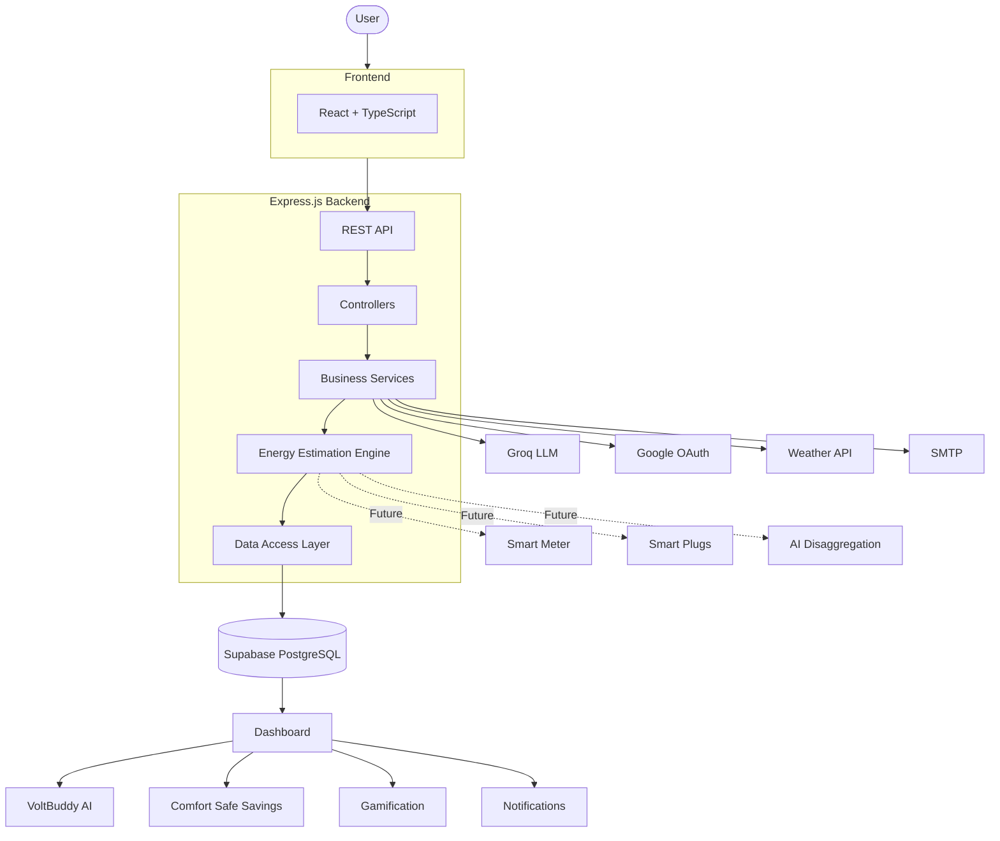

# ⚡ Voltify — AI Energy Intelligence for Every Indian Household

> *"You can't save what you can't see."*


[](https://sdgs.un.org/goals/goal7)
[](https://sdgs.un.org/goals/goal12)
[](https://sdgs.un.org/goals/goal13)

---

## 👥 Team Details

- **Team Name:** CODE HUNTRIX
- **Hackathon:** RUSHHOUR
- **Institution:** Saveetha Engineering College, Chennai
- **Team Members:**
  - **Ramitha:** Backend & System Design
  - **Riyaz:** Frontend & UX Design
  - **Nabithra:** Research & Product Strategy
  - **Deepshika:** AI & ML Engineer

---

## ❗ Problem Statement

Despite being the world's third-largest electricity consumer, over 80% of Indian households have zero appliance-level energy visibility. Most families receive only a single electricity bill at the end of the month, with no insight into how, when, or which appliances consumed the energy. This lack of transparency often results in unexpected bill shock, energy wastage, and poor consumption habits.

Existing energy-monitoring solutions rely on expensive hardware such as smart plugs and smart meters (₹15,000+), making them inaccessible to the vast majority of households and serving only a small fraction of the population. As a result, users have:

* No appliance-level energy disaggregation
* No real-time visibility into consumption, spikes, anomalies, or safety risks
* No way to predict future electricity usage or optimize bills proactively
* No actionable insights to make smarter energy decisions
* Low user engagement and motivation, since feedback arrives only once a month through the electricity bill

---

## ✅ Solution: The Voltify Inclusion Layer

**Voltify** is an AI-powered residential energy intelligence platform built to serve **all Indian households**, regardless of meter type. It builds intelligence on top of existing infrastructure through a **3-Tier architecture**:

| Tier | Users | Infrastructure | How Voltify Works |
|---|---|---|---|
| **Tier 1** ✅ *Live* | Basic meter users (~78%) | Monthly EB bill | Upload bill + enter appliances → rule-based disaggregation |
| **Tier 2** 🔜 | Smart meter users (~20%) | 15-min interval data | DISCOM API integration + AI disaggregation |
| **Tier 3** 🔜 | Smart plug users (~2%) | Per-appliance real-time | IoT Cloud API (Tuya / TP-Link Tapo) |

The **Tier 1 prototype** delivers immediate value to the largest segment with zero hardware dependency.

---

## 🚀 Key Features

- **Appliance Disaggregation:** Breaks down total monthly bill into per-appliance usage and cost — no smart meter needed. Calibrated to match the user's actual electricity bill.
- **Comfort-Safe Savings (CSS):** Shows the exact tradeoff between comfort (AC at 18°C vs 24°C) and monthly ₹ savings. Every recommendation is bounded by **BEE and WHO guidelines**.
- **VoltBuddy AI Assistant:** Conversational energy coach powered by **Groq (Llama 3.3 70B)** that answers bill questions and gives personalised appliance tips. Falls back to a smart rule-based engine if unavailable.
- **What-If Simulator:** Simulate reducing AC hours, shifting geyser usage, or changing fridge temperature — and instantly see projected monthly ₹ savings before committing.
- **Predictive Alerts:** 7-day and 30-day forecasts. Bill shock alert when you're on track to exceed last month's bill.
- **Behavioural Gamification:** Daily check-ins (coins), weekly challenges, streak multipliers (up to 1.6×), community leaderboard, and a coin redemption shop — making conservation a habit, not a chore.
- **Daily / Weekly / Monthly Insights:** 30-day trend charts, appliance-wise cost breakdown, carbon footprint (kg CO₂/month), and a single **Energy Score (0–100)**.

---

## 🛠 Complete Tech Stack

### Frontend & UI

| Technology | Purpose |
|---|---|
| React 19 + TypeScript | Component-based dashboard; TypeScript enforces correct kWh/₹ data types |
| Vite | Fast HMR dev server and lightweight production bundling |
| Tailwind CSS v4 | Utility-first dark glassmorphic UI without writing custom CSS |
| Recharts | React-native charts for energy trends, appliance pies, and forecast lines |
| Framer Motion | Micro-animations on coins, streaks, and gamification cards |
| Zustand | Lightweight global state (auth, dashboard, gamification) |
| React Hook Form + Zod | Form validation — rejects invalid appliance data before the engine sees it |

### Backend & API

| Technology | Purpose |
|---|---|
| Node.js + Express | Non-blocking API server; handles weather + DB + estimation in a single response cycle |
| PostgreSQL via Supabase | Relational store for users → appliances → bills → estimates; built-in RLS and pooling |
| JWT + Passport.js | Stateless auth with Google OAuth 2.0; no server-side sessions |
| Groq API (Llama 3.3 70B) | Free-tier LLM for VoltBuddy chat and PDF bill text extraction |
| unpdf | Pure-JS in-memory PDF text extraction — no system dependencies |
| bcrypt + Nodemailer | Password hashing and OTP email for secure account creation |
| WeatherAPI / Open-Meteo | Live temperature data dynamically adjusts AC and geyser estimates |

---

## 🏗 System Architecture



### Detailed Workflow


---

## 📂 Folder Structure

```
Voltify/
├── voltify-frontend/                  # React + TypeScript SPA
│   └── src/
│       ├── pages/                     # Dashboard, Predictions, Streak, Leaderboard, Shop, Profile
│       │   ├── auth/                  # Login, Signup, OTP, Forgot/Reset Password
│       │   └── onboarding/            # Multi-step setup wizard (bill + appliances)
│       ├── components/
│       │   ├── dashboard/             # DailyEnergyChart, ApplianceAllocationChart
│       │   ├── layout/                # AppShell, Topbar
│       │   └── ui/                    # GlassCard, ChatbotVolt
│       ├── store/                     # Zustand: authStore, dashboardStore, gamificationStore
│       └── lib/                       # Axios API client
│
└── voltify-backend/                   # Node.js + Express REST API
    ├── app.js                         # Express setup, middleware, route mounting
    ├── apply_schema.js                # One-time DB schema runner
    └── src/
        ├── controllers/               # Auth, Dashboard, Coach, Gamification, Onboarding
        ├── routes/                    # REST API route definitions
        ├── services/                  # Estimation engine, LLM, coins, challenges, weather, email
        ├── config/                    # DB pool, Passport, SQL schema
        ├── middleware/                # JWT auth, error handler
        └── utils/                     # JWT helpers, validators
```

---

## ⚙️ Installation and Usage Guide

### Prerequisites

- **Node.js v18+**
- **PostgreSQL** (or a free [Supabase](https://supabase.com) project)
- **Groq API key** — free at [console.groq.com](https://console.groq.com)
- **Gmail App Password** — for OTP and password-reset emails

### 1. Clone the Repository

```bash
git clone https://github.com/your-org/voltify.git
cd voltify
```

### 2. Backend Setup

```bash
cd voltify-backend
npm install
cp .env.example .env        # Fill in your credentials
node apply_schema.js        # Create all database tables (run once)
npm run dev                 # Starts on http://localhost:5000
```

**Key `.env` variables:**

```env
DATABASE_URL=your_postgresql_url
JWT_SECRET=your_jwt_secret
GROQ_API_KEY=your_groq_key
GMAIL_USER=your@gmail.com
GMAIL_APP_PASSWORD=your_app_password
GOOGLE_CLIENT_ID=...
GOOGLE_CLIENT_SECRET=...
FRONTEND_URL=http://localhost:5173
```

### 3. Frontend Setup

```bash
cd voltify-frontend
npm install
# Create .env → VITE_API_URL=http://localhost:5000
npm run dev                 # Starts on http://localhost:5173
```

### 4. First Use

Sign Up → Onboard → Dashboard → VoltBuddy & CSS → Daily Check-in → Earn & Redeem

---

## 🔌 API / Database Documentation

### API Endpoints (Base: `http://localhost:5000/api`)

All routes marked ✅ require `Authorization: Bearer <JWT>` header.

| Prefix | Endpoints | Description |
|---|---|---|
| `/auth` | POST `/signup`, `/login`, `/verify-otp`, `/forgot-password`, `/reset-password`; GET `/google`, `/me` ✅ | Auth, OTP, Google OAuth |
| `/onboarding` ✅ | POST `/profile`, `/bill`, `/appliances`, `/parse-bill` | Household setup + bill parsing |
| `/dashboard` ✅ | GET `/summary`, `/usage`, `/appliance-breakdown`, `/insights` | Energy data for dashboard |
| `/coach` ✅ | GET `/predictions`, `/alerts`, `/css-recommendations`, `/whatif`; POST `/css-apply`, `/chat` | AI features, VoltBuddy, What-If |
| `/gamification` ✅ | GET `/stats`, `/challenge`, `/shop`; POST `/check-in`, `/redeem` | Coins, streaks, challenges |
| `/leaderboard` ✅ | GET `/` | Community rankings |
| `/profile` ✅ | GET/PUT `/` | User profile |
| `/settings` ✅ | PUT `/password`, `/calibration` | Account management |

### Database Schema

```sql
users               -- id, name, email, tier, coins, streak_days, onboarding_complete
appliances          -- id, user_id, name, power_kw, avg_hours_day, seasonality
monthly_bills       -- id, user_id, month, bill_amount, units, estimated_units, accuracy_pct
daily_estimates     -- id, user_id, date, estimated_units, estimated_cost
appliance_estimates -- id, user_id, appliance_id, month, estimated_units, estimated_pct, estimated_cost
css_applications    -- id, user_id, appliance_id, setting_type, applied_value, applied_at
```

All tables cascade-delete on user removal. Supabase RLS enforces row-level isolation.

---

## 🧠 AI/ML Workflow


#### 🔌 NILM — Non-Intrusive Load Monitoring
Estimates appliance-wise energy consumption from total smart meter readings without requiring additional hardware.

#### 🧠 LSTM — Long Short-Term Memory
Learns long-term electricity usage patterns to accurately forecast future energy consumption and bills.

#### 🚨 Isolation Forest — Anomaly Detection
Detects unusual energy usage patterns, appliance faults, and potential electricity wastage.

---

## 🛡 Security Measures

- **Authentication:** JWT (7-day expiry, stateless) + bcrypt password hashing + Google OAuth 2.0 via Passport.js
- **Data Isolation:** Supabase Row-Level Security ensures users only access their own data at the database level
- **Route Protection:** `requireAuth` middleware validates every protected endpoint — missing or expired tokens return 401
- **File Upload Safety:** Multer memory storage — uploaded PDFs are never written to disk and are discarded after parsing
- **CORS:** Explicit origin whitelist — all unlisted domains are blocked
- **Input Validation:** Zod schemas (frontend) + validators.js (backend) reject malformed data before the engine processes it
- **Email OTP:** Time-limited OTPs for signup verification and password reset via Nodemailer
- **Safety Thresholds:** CSS engine hardcodes BEE/WHO limits — AC is never recommended below 24°C regardless of user input
- **Secrets:** All keys in `.env`, excluded from git via `.gitignore`

---

## 📊 Testing and Performance

### Tests

```bash
cd voltify-backend
node test-integration.js    # End-to-end: auth → onboarding → dashboard → gamification
node test_pg.js             # PostgreSQL connection health check
node test_pooler.js         # Supabase connection pooler validation
```

`test-integration.js` covers the full API flow — signup, OTP, onboarding pipeline, estimation calibration accuracy, gamification state, CSS recommendations, and What-If output.

### Performance

| Area | Result |
|---|---|
| Estimation engine (Tier 1) | Pure JS arithmetic — no ML inference; avg response < 50ms |
| VoltBuddy (Groq) | ~800ms average; rule-based fallback responds in < 5ms |
| Dashboard load | Daily estimates pre-stored in DB — charts read cache, not re-running estimation live |
| PDF parsing | Processed entirely in memory by unpdf — no disk I/O |
| Frontend bundle | Vite code-splits by route — heavy libraries load only on pages that need them |

---

## 🚧 Challenges Faced and Future Scope

### Challenges Faced

- **Hardware barrier:** Early research confirmed existing solutions required ₹4,000–15,000 in hardware. We rejected sensors entirely and built a software-only estimation engine calibrated to real bills.
- **Variable bill formats:** EB bills differ across DISCOMs. We solved this by combining PDF text extraction with Groq JSON-mode parsing and a manual-entry fallback UI.
- **LLM reliability:** Groq API rate limits and occasional downtime are mitigated by a full rule-based NLP engine — VoltBuddy never goes offline.
- **Keeping users engaged beyond day 1:** Streak multipliers (up to 1.60×), weekly auto-generated challenges, and a coin-to-rewards shop create a real habit loop.

### Future Scope

- **Phase 2 — Smart Meter Integration:** Formal DISCOM API integration for 15-minute interval data, NILM disaggregation, Isolation Forest anomaly detection, and confidence scores rising to 90%+
- **Phase 3 — National Scale:** Smart plug real-time monitoring, LSTM/GRU personalised models, B2G DISCOM analytics licensing, national coin reward ecosystem with brand partnerships
- **Multilingual Support:** Tamil, Hindi, Telugu, and Kannada for Tier 2/3 city accessibility
- **Carbon Credit Marketplace:** Allow households to trade verified CO₂ savings with ESG-focused corporates
- **B2B Dashboards:** Energy management portals for housing societies, campuses, and small businesses

---

## 🎬 Demo


---

## 📚 References

1. Bureau of Energy Efficiency (BEE) — [beeindia.gov.in](https://beeindia.gov.in)
2. Ministry of Power, Government of India — [powermin.gov.in](https://powermin.gov.in)
3. International Energy Agency — [iea.org](https://www.iea.org)
4. Electric Energy Disaggregation via NILM (ScienceDirect, 2022) — [link](https://www.sciencedirect.com/science/article/abs/pii/S0378779622007398)
5. NILMFormer: Transformer-based NILM Architecture (arXiv, 2025) — [link](https://arxiv.org/html/2506.05880v1)
6. UK-DALE Energy Dataset — [ukerc.rl.ac.uk](https://ukerc.rl.ac.uk)
7. Gamification and Eco-Feedback in Energy Savings (ScienceDirect, 2025) — [link](https://www.sciencedirect.com/science/article/pii/S036054422503138X)
8. Groq API — [console.groq.com](https://console.groq.com)
9. Supabase Documentation — [supabase.com/docs](https://supabase.com/docs)
10. Open-Meteo (free weather API) — [open-meteo.com](https://open-meteo.com)

---

<div align="center">

Built by **Team CODE HUNTRIX** · Saveetha Engineering College, Chennai  

</div>
